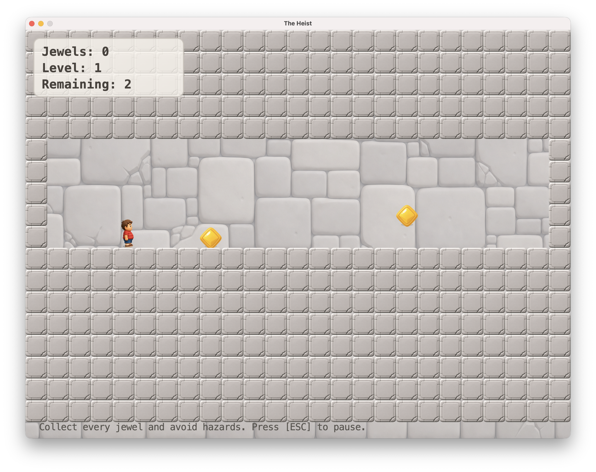
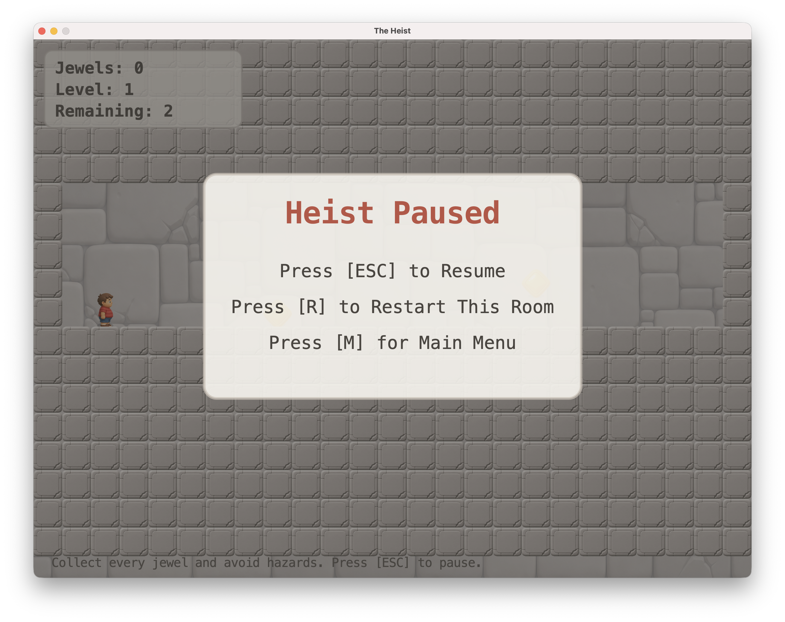

# The Heist

`The Heist` is a small Java platformer game where the player moves through dangerous rooms, collects every jewel, and avoids hazards to finish the run. It utilizes core java principles to dynamically load in levels and test functions for programming efficiency. Designed, architected and programmed by Angad Batth. Images/Sprites and game assets generated by ChatGPT Imagine

  

## Screenshots

  
  

  
  

  
Quick gameplay preview

   
  

    
  

## What The Game Has

- Multiple text dynamically loaded levels
- Player movement, jumping, collisions, and hazards
- High score saving with file I/O
- A state-driven menu / play / game over flow
- Claymorphic art assets and a packaged desktop build flow

## Controls

- `A / LEFT` = move left
- `D / RIGHT` = move right
- `W / SPACE` = jump
- `ESC` = pause / resume
- `R` = restart current room while paused
- `M` = return to menu while paused

## What I Learned Making It

This project gave me hands on practice with core Java and object oriented programming ideas:

- `OOP` by breaking the game into models, views, controllers, and utilities
- `Encapsulation` by keeping entity data and behavior inside classes like `Player`, `Obstacle`, and `LevelManager`
- `Inheritance` by building shared behavior through the `Entity` base class
- `Polymorphism` by updating and rendering many entity types through shared parent references
- `Game State Management` by separating menu, gameplay, pause flow, and game-over logic
- `File I/O` by loading level maps from text files and saving high scores to disk
- `Collision Logic` through shared physics helper methods
- `Recursion` in the `ScannerAlgorithm` utility and its related JUnit test
- `Testing` with JUnit for utility logic and score loading behavior
- `Packaging` by turning the project into a runnable jar and a desktop app image

## Project Structure

- `src/` = main Java source code
- `assets/` = levels, data, and image assets
- `optimization/tests/` = JUnit tests
- `scripts/` = helper scripts for running, building, and packaging

## Running The Game

Quick run:

- `./run-game.command`
- or `bash scripts/run-game.sh`

## Build The Runnable Jar

- `./build-jar.command`
- or `bash scripts/build-jar.sh`

This creates:

- `dist/the-heist.jar`

## Package The Desktop App

- `./package-app.command`
- or `bash scripts/package-app.sh`

This creates:

- `release/The Heist.app`
